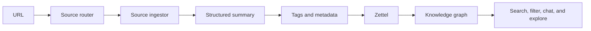
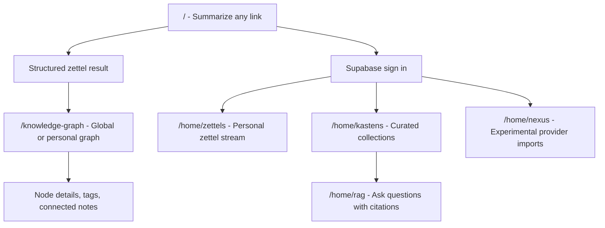
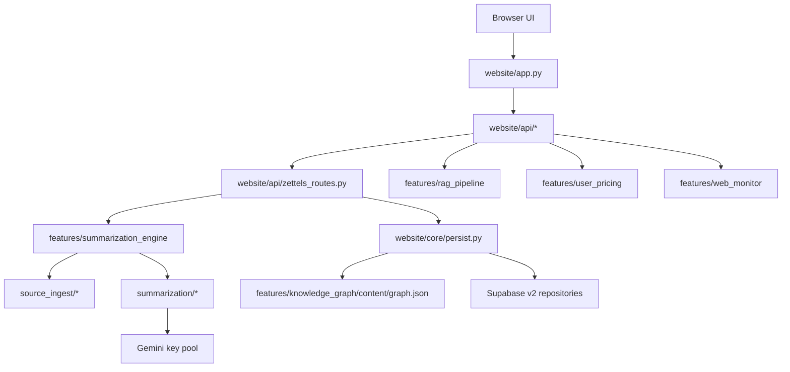

# Zettelkasten

Turn links into connected notes you can revisit, search, and explore as a knowledge graph.

[Open the live product](https://zettelkasten.in) | [Explore the code map](#project-structure) | [Builder docs](#for-builders)

Zettelkasten is a hosted web app for turning useful URLs into "zettels": compact, source-grounded knowledge objects with a title, key takeaways, a detailed summary, tags, source metadata, and graph connections to related notes. It is built for the moment when ordinary bookmarks stop being enough. Instead of saving a link and hoping you remember why it mattered, Zettelkasten extracts the source, summarizes the ideas, files the result into your knowledge stream, and makes the relationships visible.

## What It Does

Paste a URL into the summarizer and the app detects what kind of source it is, extracts the useful content, summarizes it with Gemini, stores the result, and links it into the graph by tags and related concepts.



## Why Zettels Beat Bookmarks

A bookmark remembers where something was. A zettel remembers what mattered.

Each capture becomes a durable note that can stand on its own: the original source stays linked, but the useful ideas are extracted into a readable form. Over time, those notes become more valuable because the graph shows repeated topics, source clusters, and unexpected connections across videos, posts, papers, repositories, and articles.

## A Capture Example

| Input | Output |
|---|---|
| A YouTube talk, GitHub repository, Reddit thread, newsletter post, arXiv paper, podcast page, Hacker News item, LinkedIn post, X/Twitter post, or generic web article | A zettel with a title, one-line summary, key takeaways, detailed summary, normalized tags, source URL, capture metadata, and graph links |

Example transformation:

```text
URL: https://github.com/fastapi/fastapi

Zettel:
Title: FastAPI framework overview
Key takeaways:
- FastAPI is a Python web framework centered on type hints and OpenAPI.
- Its design emphasizes async support, validation, and automatic docs.
- The repository structure and docs make it useful as both a library and a learning reference.
Tags: python, web-framework, api-design, openapi
Graph: linked to other notes tagged python, backend, async, and api-design
```

## Capabilities

| Area | What the product supports |
|---|---|
| Capture | URL intake, redirect resolution, URL normalization, source detection, source-specific extraction, and graceful handling when content is too thin to summarize safely |
| Understand | Gemini-backed summaries with brief and detailed sections, source metadata, extraction confidence, model fallback telemetry, and source-specific summarization paths |
| Organize | Zettels, tags, personal zettel views, Kastens, graph nodes, graph links, and file-store fallback for the public graph |
| Explore | Interactive 3D knowledge graph, graph search/filter controls, graph analytics enrichment, personal/global graph modes, and citation-oriented RAG chat over signed-in content |
| Accounts | Supabase Auth-backed login, profile/avatar support, personal zettel and Kasten surfaces, pricing/entitlement checks, and payment integration |
| Import experiments | Nexus provider connection and bulk-import flows for selected external providers when the experimental feature is enabled |

## Product Tour

The committed repository does not currently include fresh product screenshots that are safe to present as canonical. The durable tour below mirrors the live product surfaces from the current FastAPI routes and static pages.



## Project Structure

```text
.
|-- run.py                     # Application process entry point
|-- pyproject.toml             # Pytest config and project metadata
|-- website/                   # FastAPI app, static pages, APIs, core services, features
|   |-- app.py                 # App factory, route mounting, static asset mounting
|   |-- api/                   # Public API, auth, RAG chat, sandbox/Kasten, Nexus routes
|   |-- core/                  # Persistence, settings, graph store, Supabase v2 clients
|   |-- features/              # Product feature packages and UI assets
|   |-- experimental_features/ # Live-gated experiments such as Nexus and local PageIndex RAG
|   |-- mobile/                # Mobile summarizer and graph pages
|   |-- static/                # Public summarizer page assets
|   `-- artifacts/             # Logos, icons, avatars, and committed visual assets
|-- supabase/                  # SQL schema assets, especially the active website/_v2 migrations
|-- ops/                       # Operations, migration, maintenance, and packaging scripts
|-- tests/                     # Unit, integration, live, RAG, pricing, and migration tests
|-- docs/                      # Runbooks, system reports, design specs, eval artifacts, DB v2 docs
`-- models/                    # Shared capture-era models kept for compatibility
```

## Architecture Snapshot



The public Add Zettel path is `POST /api/zettels/add`. It resolves auth, maps anonymous captures to the canonical Zoro user, delegates extraction and summarization to the summarization engine, then persists through `website/core/persist.py`.

## For Builders

This root README is intentionally a front door, not the operations manual. Use the scoped docs below when you need implementation detail:

| Need | Start here |
|---|---|
| Repository-wide rules, commands, testing expectations, and secret handling | [`AGENTS.md`](AGENTS.md) |
| FastAPI feature layer and product surfaces | [`website/features/About.md`](website/features/About.md) |
| Summarization engine internals and source extension path | [`website/features/summarization_engine/About.md`](website/features/summarization_engine/About.md) |
| Browser-side cache behavior | [`website/features/browser_cache/About.md`](website/features/browser_cache/About.md) |
| Experimental Nexus and PageIndex RAG surfaces | [`website/experimental_features/About.md`](website/experimental_features/About.md) |
| Supabase schema assets and DB v2 migration rules | [`supabase/About.md`](supabase/About.md) |
| DB v2 cutover, rollback, and closeout context | [`docs/db-v2/`](docs/db-v2/) |
| Production runbooks and operational procedures | [`docs/runbooks/`](docs/runbooks/) and [`ops/`](ops/) |
| Evaluation and quality-loop artifacts | [`docs/summary_eval/`](docs/summary_eval/) and [`docs/rag_eval/`](docs/rag_eval/) |

## Source Coverage

The current summarization engine routes these source families:

| Source family | Examples |
|---|---|
| Code | GitHub repositories and related GitHub URLs |
| Video/audio | YouTube, podcast pages |
| Social/discussion | Reddit, Hacker News, LinkedIn, X/Twitter |
| Publishing | Newsletters, Substack-like posts, Medium/dev-style articles |
| Research | arXiv and ar5iv pages |
| Web | Generic web pages that do not match a more specific route |

## Status

Zettelkasten is a production web app with a live hosted interface, a FastAPI backend, Supabase v2 persistence for authenticated product paths, and a file-backed public graph fallback. Operational details are documented outside this README.
