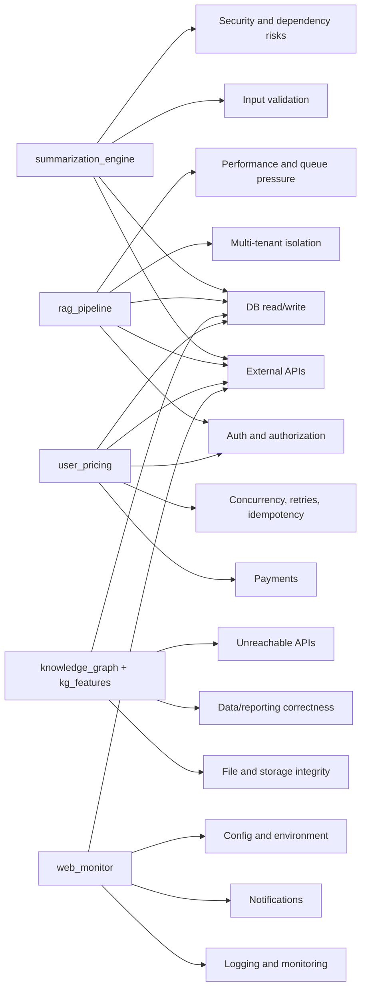
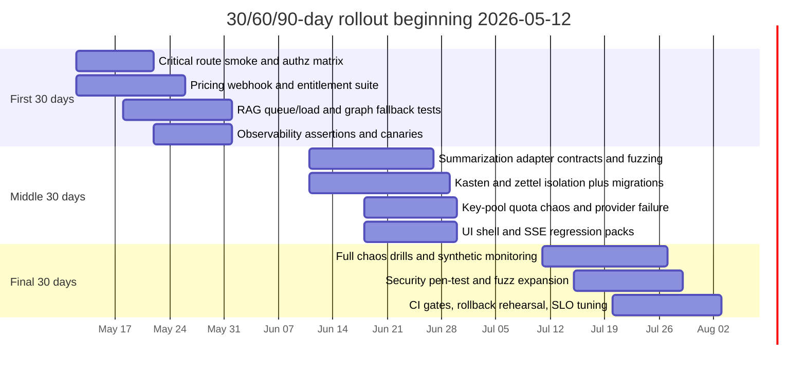

# Risk-Based Test Strategy for the Website Feature Layer

## Executive summary

The attached `About.md` describes a feature layer with **14 major modules**: `api_key_switching`, `browser_cache`, `header`, `knowledge_graph`, `kg_features`, `rag_pipeline`, `summarization_engine`, `user_auth`, `user_home`, `user_zettels`, `user_kastens`, `user_rag`, `user_pricing`, and `web_monitor`. The highest-risk concentration is in **`summarization_engine`**, **`rag_pipeline`**, and **`user_pricing`**, followed by **`knowledge_graph` / `kg_features`**, **`user_auth`**, **`user_kastens`**, **`user_zettels`**, **`api_key_switching`**, and **`web_monitor`**. Those modules combine the greatest number of failure classes from the earlier “concrete misses” taxonomy: untrusted input, external-provider dependence, mutable state, authorization boundaries, quota/rate/queue pressure, and cross-boundary persistence. fileciteturn0file0L24-L41 fileciteturn0file0L56-L111

This codebase should be tested as an **integration-first system**, not as a collection of isolated feature packages. The same `About.md` explicitly says the feature folder is **not** an app boundary: routing, persistence, auth dependencies, and middleware are assembled elsewhere in `website/app.py`, `website/api/`, and `website/core/`. That means broken behavior will often emerge at the seams between mounted assets, API routes, auth checks, persistence, and external services rather than inside pure functions alone. fileciteturn0file0L15-L22 fileciteturn0file0L43-L54 fileciteturn0file0L134-L143 citeturn0search7turn2search2turn2search3turn2search18

The most urgent test work should start with six production-critical paths: **URL capture and source ingestion**, **RAG session/runtime authorization and queue saturation**, **graph assembly and file-backed fallback**, **Kasten share/member authorization**, **payment webhook verification and entitlement accounting**, and **monitoring/alert isolation**. Those are the areas where the file documents concrete runtime invariants such as “entitlement consume only after accepted work,” “RAG runtime requires authenticated UUID,” “bounded rerank admission returns retryable 503,” “webhooks are canonical payment truth,” “graph falls back to file-store,” and “alerting failures are swallowed so user responses keep working.” fileciteturn0file0L58-L65 fileciteturn0file0L67-L81 fileciteturn0file0L83-L101

There is already documented test coverage for **summarization**, **key pooling**, **KG analytics**, **RAG**, and **pricing**, which is a strong starting point. The larger apparent blind spot is the set of **cross-feature flows and UI-heavy modules** whose tests are not explicitly called out in the feature-layer map: `browser_cache`, `header`, `knowledge_graph` UI assets, `user_auth`, `user_home`, `user_zettels`, `user_kastens`, `user_rag`, and `web_monitor`. That does not prove they are untested, but it does mean the current folder-level documentation does not advertise coverage there, so those areas should be treated as probable assurance gaps until verified. fileciteturn0file0L123-L132

| Risk tier | Modules | Why they should move first |
|---|---|---|
| Critical | `summarization_engine`, `rag_pipeline`, `user_pricing` | Highest concentration of external APIs, mutable state, authorization, rate/quota/queue pressure, and business-side correctness |
| High | `knowledge_graph`, `kg_features`, `api_key_switching`, `user_auth`, `user_zettels`, `user_kastens`, `web_monitor` | Frequent cross-boundary reads/writes, fallback behavior, or security/observability-critical responsibilities |
| Moderate | `user_rag`, `browser_cache`, `header`, `user_home` | User-facing reliability and security still matter, but blast radius is usually lower and failures are more visible |

## Scope and extracted module map

This report uses the feature-layer map as the architectural source of truth and applies the earlier “concrete misses” taxonomy to each extracted sub-flow. For scoring, **H** means the miss category is a primary failure mode for that sub-flow, **M** means it is an important secondary concern, **L** means it is low-relevance or mostly a regression concern, and **unlisted categories are treated as negligible or not evidenced in this pass**. The test recommendations are aligned to the official guidance in the urlOWASP API Security Top 10turn0search4, the current urlOWASP Top Tenturn0search5, the urlMITRE CWE Top 25turn5search17, the urlNIST SSDFturn0search7, the urlAWS Reliability Pillarturn1search4, the urlAzure transient-fault guidanceturn1search2, and the urlSRE Book chapter on cascading failuresturn1search3. citeturn0search4turn0search5turn5search17turn0search7turn1search4turn1search2turn1search3

The feature layer sits inside a entity["software","FastAPI","Python ASGI web framework"] application and depends materially on urlSupabaseturn2search9 for user-scoped persistence and on urlRazorpayturn2search12 for pricing and payments. Some deeper module behavior is specified only partially at this folder level, so thin presentation modules are best-effort extractions from their mounts, routes, and runtime notes rather than exhaustive behavioral specs. fileciteturn0file0L3-L5 fileciteturn0file0L24-L41 fileciteturn0file0L103-L111 fileciteturn0file0L145-L160

| Major module | Extracted responsibilities | Best-effort minor modules and sub-flows |
|---|---|---|
| `api_key_switching` | Shared Gemini key pool, key discovery, cooldowns, retries, embedding calls, routing helpers | Pool bootstrap; key selection and cooldown arbitration; embedding/generation helper calls; content-aware routing |
| `browser_cache` | Non-secret browser-side UX hints and auth return-path storage | Return-path storage; non-secret UX preference cache; malformed storage recovery |
| `header` | Shared header fragment, CSS, JS for inner pages | Fragment render; shell injection integration; nav/JS behavior; static asset integrity |
| `knowledge_graph` | Desktop graph UI assets and file-backed graph asset | Graph page boot; `/api/graph` read path; authenticated v2 assembly to file fallback; cached first page |
| `kg_features` | Graph analytics and embedding utilities | Graph metrics; analytics enrichment; embedding generation |
| `rag_pipeline` | Authenticated RAG runtime over zettels and Kastens | Runtime bootstrap; session/Kasten store binding; retrieval and reranking; context assembly and answer streaming; post-answer side effects |
| `summarization_engine` | v2 ingestion, summarization, batch, writers, evaluator, dashboard, `/api/v2` routes | URL intake and safety; source detection; source ingestors; source summarizers; batch upload/stream; writers; evaluator helpers |
| `user_auth` | Supabase auth callback page and auth client assets | Callback handling; return-path reconciliation; session bootstrap; auth-state error handling |
| `user_home` | Signed-in home page assets | Home shell render; signed-in state boot; shared header/footer integration |
| `user_zettels` | Personal zettel stream UI | Stream load; list/filter/pagination; zettel API integration; graph/zettel interaction |
| `user_kastens` | Kasten management UI | CRUD; share/member operations; tag/source-filter compatibility path |
| `user_rag` | RAG chat UI and example-query content | Chat page boot; session/message render; SSE/adhoc integration; retry/error UX |
| `user_pricing` | Pricing catalog, entitlements, payment routes, subscriptions, checkout launcher | Catalog/billing; order/subscription mutations; payment verification; webhook ingestion; entitlement require/consume; checkout launcher secrecy |
| `web_monitor` | Slack-backed monitoring and alert routers | Inbound monitoring/webhook routes; outbound alert fan-out; scheduled notifications; failure isolation |

The diagram below focuses on the highest-risk module-to-miss relationships. It is a synthesis of the runtime flows and invariants described in `About.md` and the failure classes emphasized by OWASP, NIST, AWS, Azure, and the SRE book. fileciteturn0file0L56-L143 citeturn3search6turn3search18turn3search1turn4search4turn1search0turn1search2turn1search3

## Module-by-module analysis

The tables below translate the feature map into a practical test plan. For test depth, **MUST** means the test type should be implemented in the first wave, **SHOULD** means it should follow shortly after the first wave, and **NICE-TO-HAVE** means it adds confidence but is not the critical starting point. For this codebase, that order is driven mostly by OWASP’s API emphasis on broken authn/authz, property-level exposure, function-level authorization, and resource controls; by NIST’s advice to derive tests from design/code artifacts and to use fuzzing for input handling; and by AWS/Azure/SRE guidance on idempotency, retries, quotas, and cascading-failure containment. citeturn3search6turn3search3turn3search18turn3search1turn4search4turn1search0turn1search1turn1search2turn1search3

### Core intelligence and retrieval modules

#### `summarization_engine`

This module owns the v2 summarization surface: URL ingestion, source detection, source-specific ingestion and summarization, batch routes, writers, evaluator helpers, dashboard assets, and registry extension points. In the representative runtime flow it validates URL safety, rejects near-empty extraction, returns legacy-compatible payloads, and coordinates with persistence and entitlement boundaries. fileciteturn0file0L10-L12 fileciteturn0file0L34-L35 fileciteturn0file0L50-L54 fileciteturn0file0L58-L65 fileciteturn0file0L115-L116

| Sub-flow | Responsibilities | Miss relevance | Required tests and depth |
|---|---|---|---|
| URL intake and source detection | Accept URL input, resolve type, enforce safety checks, reject obviously bad captures | **H:** input validation, external APIs, unreachable APIs, security/dependencies — untrusted URLs and multi-source fetchers are the first trust boundary. **M:** business logic, config/env, testing process. **L:** notifications, payments | **MUST:** unit, integration, fuzzing, security pen-test for SSRF/open redirects/unsafe fetch, smoke. **SHOULD:** contract tests per source adapter, observability checks |
| Registry-driven ingestion and source summarization | Run registered ingestors and summarizers for GitHub, Reddit, YouTube, newsletters, HN, arXiv, podcasts, Twitter/Nitter, LinkedIn, generic web, and others | **H:** broken modules, external APIs, business logic, performance/scalability — registry drift and upstream schema changes are high-probability breaks. **M:** logging/monitoring, config/env, CI/CD. **L:** multi-tenant, notifications | **MUST:** unit per adapter, contract tests with recorded fixtures, integration, load on representative long content. **SHOULD:** chaos on provider outage/quota exhaustion |
| Batch upload, stream, and writer flows | Handle batch endpoints, uploads, streams, writer outputs, evaluator helpers | **H:** file/storage, DB write/read, concurrency/retries, performance/scalability — batch work amplifies partial-failure risks. **M:** input validation, logging/monitoring, background jobs. **L:** payments | **MUST:** integration, e2e for upload/stream, idempotency, migration tests where DB writes occur, observability checks. **SHOULD:** load and chaos on partial batch failure |
| Post-accept persistence and entitlement boundary | Persist accepted work only after valid capture and consume entitlement after acceptance | **H:** DB write/read, business logic, auth/authorization — wrong ordering can overcharge or lose data. **M:** concurrency/retries, multi-tenant, logging/monitoring. **L:** frontend integration | **MUST:** integration, idempotency, concurrency, authz, reconciliation tests. **SHOULD:** synthetic monitoring of the full summarize journey |

**Top 5 immediate actions:** URL safety and malicious-input fuzzing; source-adapter contract fixtures for the top ingestion sources; batch upload partial-failure and retry suite; accepted-work-only entitlement accounting test; provider outage/quota chaos with alert assertions.

#### `rag_pipeline`

This is the most complex runtime in the map: authenticated UUID-scoped runtime creation, session and Kasten stores, chunk embedding, hybrid retrieval, graph scoring, cascade reranking, context assembly, LLM routing, answer criticism, citation metadata, evaluation/scoring, and post-answer side effects. The file also documents a bounded rerank queue that returns a retryable `503` when saturated. fileciteturn0file0L12-L12 fileciteturn0file0L33-L34 fileciteturn0file0L48-L49 fileciteturn0file0L75-L81 fileciteturn0file0L117-L118 fileciteturn0file0L139-L140

| Sub-flow | Responsibilities | Miss relevance | Required tests and depth |
|---|---|---|---|
| Runtime bootstrap and user/workspace scoping | Build user-scoped runtime from auth subject, bind session and Kasten stores | **H:** auth/authorization, multi-tenant, DB read/write — this is the principal access-control boundary. **M:** broken modules, config/env, logging/monitoring. **L:** payments | **MUST:** integration, authz matrix, e2e, security pen-test for BOLA/BFLA, migration tests on store contracts. **SHOULD:** synthetic signed-in chat smoke |
| Retrieval, graph scoring, reranking | Embed/query, retrieve chunks, score graph relevance, rerank, handle queue boundaries | **H:** external APIs, performance/scalability, concurrency/retries, DB read failure — computationally and operationally the hottest path. **M:** config/env, infra/runtime, logging/monitoring. **L:** notifications | **MUST:** load, concurrency, chaos, integration, queue-saturation tests. **SHOULD:** performance baselines in CI and synthetic pressure canaries |
| Context assembly, LLM routing, answer criticism | Assemble prompts/context, select backend, generate answer with criticism and citation metadata | **H:** business logic, external APIs, security/dependencies, frontend integration — answer quality and citation integrity can fail without obvious crashes. **M:** input validation, observability, testing process. **L:** payments | **MUST:** contract, integration, e2e streaming, citation-integrity assertions, security tests for prompt/payload boundaries. **SHOULD:** fuzzing on malformed message/context shapes |
| Post-answer side effects and evaluation | Persist messages, update sessions, scoring/evaluation, any follow-on writes | **H:** DB write failure, business logic, logging/monitoring — silent post-answer failures create hard-to-debug user state issues. **M:** background jobs, concurrency/retries, data/reporting. **L:** file/storage | **MUST:** integration, idempotency, observability, migration tests. **SHOULD:** chaos on DB/write unavailability |

**Top 5 immediate actions:** UUID authz and workspace-isolation matrix; rerank queue saturation and `503` retry UX test; end-to-end SSE chat and reconnect testing; DB write/read failover for sessions/messages; load and chaos suite for retrieval plus LLM dependency pressure.

#### `knowledge_graph`

This module owns the graph UI assets and the public file-backed graph asset. The documented read path tries authenticated v2 graph assembly first, then falls back to `knowledge_graph/content/graph.json`, enriches via analytics, and caches the default first page for 30 seconds. The file also warns that the graph asset may already be dirty from runtime captures. fileciteturn0file0L31-L32 fileciteturn0file0L47-L47 fileciteturn0file0L67-L74 fileciteturn0file0L120-L120 fileciteturn0file0L137-L138

| Sub-flow | Responsibilities | Miss relevance | Required tests and depth |
|---|---|---|---|
| Graph page boot and static asset serving | Serve graph UI assets and initialize client fetch/render behavior | **H:** frontend integration, unreachable APIs, broken modules — the page is only valuable if assets and fetch orchestration both work. **M:** file/storage, performance/scalability. **L:** payments | **MUST:** smoke, e2e, static-asset integrity checks. **SHOULD:** browser compatibility and visual regression |
| Authenticated assembly then anonymous/file fallback | Prefer v2 user graph, then serve file-store fallback if unavailable or missing | **H:** DB read failure, auth/authorization, multi-tenant, file/storage — fallback behavior can hide privilege or freshness bugs. **M:** business logic, logging/monitoring, security/dependencies. **L:** notifications | **MUST:** integration, authz, e2e, failover/fallback tests, migration tests on v2 contracts. **SHOULD:** chaos on v2 unavailability |
| Cache correctness and graph asset integrity | Cache first page for 30 seconds and protect `graph.json` correctness | **H:** data/reporting, file/storage, performance/scalability — stale or dirty graph state is a real product defect here. **M:** logging/monitoring, testing process. **L:** background jobs | **MUST:** integration, cache TTL/staleness tests, file integrity checks, load on large graphs. **SHOULD:** synthetic public graph canary |

**Top 5 immediate actions:** v2-to-file fallback integration suite; anonymous versus authenticated graph correctness check; `graph.json` integrity regression test; 30-second cache staleness/refresh test; large-graph response-size and latency baseline.

#### `kg_features`

This module provides `compute_graph_metrics()` and embedding-related utilities used by graph reads and persistence. Because those outputs influence what users see, correctness and deterministic behavior matter as much as uptime. fileciteturn0file0L32-L32 fileciteturn0file0L47-L47 fileciteturn0file0L73-L73 fileciteturn0file0L105-L105 fileciteturn0file0L127-L127

| Sub-flow | Responsibilities | Miss relevance | Required tests and depth |
|---|---|---|---|
| Graph metrics computation | Derive metrics for graph enrichment and display | **H:** data/reporting, broken modules, business logic — wrong metrics can look “successful” while being incorrect. **M:** performance/scalability, logging/monitoring. **L:** payments | **MUST:** deterministic unit tests, integration on representative graphs, observability checks for failures. **SHOULD:** property-based testing for graph-shape invariants |
| Embedding generation | Produce embeddings used by persistence and graph intelligence | **H:** external APIs, config/env, performance/scalability — provider issues and quota failures surface quickly here. **M:** security/dependencies, concurrency/retries, infra/runtime. **L:** frontend integration | **MUST:** integration, contract tests on provider responses, chaos on provider failure, load for batch embeddings. **SHOULD:** concurrency tests and quota simulations |
| Analytics enrichment boundary | Feed metrics/embeddings back into consumer routes | **H:** DB read/write, business logic, testing process — enrichment can silently drift from route expectations. **M:** CI/CD, logging/monitoring. **L:** notifications | **MUST:** integration and contract tests at consumer boundaries. **SHOULD:** regression snapshots of enriched payloads |

**Top 5 immediate actions:** deterministic metric fixtures; malformed-graph property tests; embedding outage/quota failure handling; large-graph performance baseline; enriched payload contract tests against graph consumers.

#### `api_key_switching`

This shared subsystem handles Gemini key discovery, pooling, cooldowns, retries, embeddings, and content-aware routing across summarization, KG, RAG, and evaluation tooling. The file also notes that RAG and summarization are sensitive to environment configuration and external quota. fileciteturn0file0L28-L28 fileciteturn0file0L53-L53 fileciteturn0file0L105-L105 fileciteturn0file0L126-L126 fileciteturn0file0L140-L140

| Sub-flow | Responsibilities | Miss relevance | Required tests and depth |
|---|---|---|---|
| Pool bootstrap and key discovery | Initialize pool from environment and expose shared singleton accessors | **H:** config/env, broken modules, security/dependencies — bootstrap failure can take down several product paths at once. **M:** logging/monitoring, infra/runtime. **L:** DB write/read, payments | **MUST:** unit, smoke, integration. **SHOULD:** secret-handling checks and startup observability assertions |
| Cooldowns, selection, and retry arbitration | Pick an active key, apply cooldowns, handle transient provider errors | **H:** concurrency/retries, external APIs, performance/scalability — pool contention and quota churn are primary risks. **M:** config/env, logging/monitoring. **L:** multi-tenant | **MUST:** concurrency tests, chaos, idempotency/retry tests, load. **SHOULD:** synthetic quota exhaustion canary |
| Embedding and content-aware routing helpers | Route calls for embeddings and generation based on content/use case | **H:** business logic, external APIs, testing process — routing mistakes can quietly degrade quality or cost. **M:** security/dependencies, observability. **L:** file/storage | **MUST:** contract and integration tests across consumers. **SHOULD:** comparative regression tests on route-selection behavior |

**Top 5 immediate actions:** startup env/config smoke; concurrent pool-contention test; quota exhaustion and cooldown chaos suite; route-selection regression fixtures; metrics and alert assertions for exhausted keys.

### User-facing state and experience modules

The dominant risks in this cluster are **broken authentication**, **missing authorization**, **property-level exposure**, **client/server contract drift**, and **state misuse in browser storage**. That is especially important because the feature layer relies on user-scoped persistence in urlSupabaseturn2search9, and its own notes state that browser storage must remain non-authoritative. Supabase’s guidance positions row-level security as defense in depth for controlling row access, and OWASP continues to treat broken authn/authz as top API risks. fileciteturn0file0L35-L39 fileciteturn0file0L83-L89 fileciteturn0file0L109-L109 fileciteturn0file0L119-L119 fileciteturn0file0L141-L141 citeturn2search1turn2search13turn3search6turn3search0turn3search18

#### `user_auth`

This module serves the auth callback page and auth client assets and therefore sits on the boundary between browser state, redirect handling, and authenticated server-side state. fileciteturn0file0L35-L35 fileciteturn0file0L46-L46 fileciteturn0file0L109-L109

| Sub-flow | Responsibilities | Miss relevance | Required tests and depth |
|---|---|---|---|
| Callback handling and return-path reconciliation | Complete auth callback, restore route, keep browser-side storage non-secret | **H:** auth/authorization, frontend integration, input validation — redirect and callback misuse is the central risk. **M:** security/dependencies, unreachable APIs, config/env. **L:** payments | **MUST:** e2e, security pen-test, smoke, corrupted/missing return-path tests. **SHOULD:** synthetic login callback canary |
| Auth client asset bootstrap | Initialize signed-in state from the callback and browser assets | **H:** frontend integration, auth/authorization, unreachable APIs — the page can “look fine” while auth state is broken. **M:** broken modules, logging/monitoring. **L:** background jobs | **MUST:** e2e and integration against auth-state APIs. **SHOULD:** browser compatibility regression |
| Session expiry and recovery | Recover cleanly when credentials are stale or invalid | **H:** auth/authorization, business logic, logging/monitoring — expiry handling often fails as degraded UX rather than obvious outages. **M:** config/env, security/dependencies. **L:** file/storage | **MUST:** e2e and security tests for expired/replayed/invalid tokens. **SHOULD:** observability assertions on auth failure paths |

**Top 5 immediate actions:** login callback happy/error paths; return-path storage non-secret verification; expired-token and replay handling; silent-auth-state drift tests; synthetic sign-in check from outside the cluster.

#### `user_home`

This is a smaller module, but it is the signed-in landing surface and therefore a key smoke-test indicator for the entire authenticated shell. fileciteturn0file0L36-L36 fileciteturn0file0L46-L46

| Sub-flow | Responsibilities | Miss relevance | Required tests and depth |
|---|---|---|---|
| Signed-in home render | Render the home shell for an authenticated user | **H:** frontend integration, auth/authorization — a broken signed-in shell is immediately user-visible. **M:** broken modules, unreachable APIs. **L:** payments | **MUST:** smoke and e2e. **SHOULD:** synthetic signed-in home monitor |
| Shared shell and auth-state integration | Coordinate shared header/footer and auth-derived state | **H:** frontend integration, business logic — shell composition problems can hide deeper auth regressions. **M:** performance/scalability, logging/monitoring. **L:** DB write/read | **MUST:** integration and visual/snapshot regression. **SHOULD:** browser compatibility |

**Top 5 immediate actions:** signed-in versus signed-out smoke; auth-state failure rendering; shell composition regression; asset-mount integrity check; external synthetic monitor of `/home`.

#### `user_zettels`

This module is the personal zettel stream UI and talks to graph/zettel APIs. Because zettels are user-scoped content, access control and read/write correctness dominate the risk picture. fileciteturn0file0L37-L37 fileciteturn0file0L47-L47 fileciteturn0file0L64-L65 fileciteturn0file0L106-L106

| Sub-flow | Responsibilities | Miss relevance | Required tests and depth |
|---|---|---|---|
| Stream load, list, filter, paginate | Fetch and render a user’s zettel stream | **H:** DB read failure, auth/authorization, multi-tenant, frontend integration — wrong row scope is a critical defect. **M:** performance/scalability, unreachable APIs, data/reporting. **L:** notifications | **MUST:** integration, e2e, authz matrix, pagination tests. **SHOULD:** load on large streams |
| Zettel mutation and graph/zettel integration | Combine stream UX with graph/zettel APIs and mutation flows | **H:** DB write/read, business logic, auth/authorization — write-after-read consistency and scope are critical. **M:** concurrency/retries, logging/monitoring. **L:** payments | **MUST:** integration, e2e CRUD, idempotency, observability checks. **SHOULD:** chaos on DB unavailability |
| User/workspace scoping | Ensure stream only reflects permitted content | **H:** multi-tenant, auth/authorization, security/dependencies — classic BOLA/IDOR territory. **M:** file/storage if attachments/links surface, testing process. **L:** background jobs | **MUST:** security pen-test and authz matrix. **SHOULD:** synthetic access-control probes |

**Top 5 immediate actions:** cross-user and cross-workspace isolation tests; list/filter/pagination regression; write-then-read consistency suite; stale-cache or delayed-read scenario tests; zettel-to-graph integration journey.

#### `user_kastens`

This module manages Kastens through sandbox APIs and explicitly includes list/create/update/delete, share, and member operations, plus a compatibility path for tag/source-filtered membership because of a v2 bulk-add RPC design. That makes it one of the highest-value authorization targets in the codebase. fileciteturn0file0L38-L38 fileciteturn0file0L49-L49 fileciteturn0file0L83-L88 fileciteturn0file0L93-L93

| Sub-flow | Responsibilities | Miss relevance | Required tests and depth |
|---|---|---|---|
| CRUD and list operations | Create, read, update, delete Kastens | **H:** auth/authorization, multi-tenant, DB write/read — this is a stateful user/workspace boundary. **M:** business logic, unreachable APIs, frontend integration. **L:** notifications | **MUST:** e2e, integration, authz matrix, migration tests on v2 tables/RPCs. **SHOULD:** load and observability checks |
| Share and member operations | Add/remove members, apply sharing semantics | **H:** auth/authorization, multi-tenant, business logic — share/member mistakes produce direct data leakage. **M:** concurrency/retries, logging/monitoring. **L:** payments | **MUST:** security pen-test, e2e, concurrency, idempotency. **SHOULD:** synthetic share/unshare canary |
| Compatibility bulk-add path | Preserve compatibility for tag/source-filtered operations tied to explicit workspace zettel IDs | **H:** DB write failure, business logic, testing process — compatibility code is a classic regression hotspot. **M:** CI/CD, migration, observability. **L:** file/storage | **MUST:** migration and integration tests with legacy/v2 fixtures. **SHOULD:** chaos on partial RPC failure |

**Top 5 immediate actions:** share/member authorization matrix; concurrent add/remove/idempotency suite; v2 bulk-add compatibility regression; Kasten CRUD against stale/invalid workspace IDs; synthetic Kasten list/create/delete health journey.

#### `user_rag`

This is the browser chat surface for the RAG runtime. The user-facing failure profile is dominated by client/server contract drift, broken streaming, queue-pressure handling, and citation/render correctness. fileciteturn0file0L39-L39 fileciteturn0file0L48-L49 fileciteturn0file0L77-L81

| Sub-flow | Responsibilities | Miss relevance | Required tests and depth |
|---|---|---|---|
| Chat page boot and example-query content | Mount the chat UI and seed starter interactions | **H:** frontend integration, unreachable APIs — if page boot fails, chat is dead before runtime logic matters. **M:** broken modules, performance/scalability. **L:** payments | **MUST:** smoke and e2e. **SHOULD:** browser compatibility |
| Session/message and SSE integration | Post messages, render sessions, consume streamed responses | **H:** frontend integration, unreachable APIs, performance/scalability — SSE failures can be intermittent and user-specific. **M:** auth/authorization, logging/monitoring. **L:** file/storage | **MUST:** e2e, contract, load on concurrent streams, observability checks. **SHOULD:** reconnect and network-flap testing |
| Retry/error UX for bounded queues and adhoc chat | Handle retryable `503` and other dependency failures sensibly | **H:** business logic, concurrency/retries, frontend integration — correct error semantics matter because queue saturation is documented. **M:** security/dependencies, testing process. **L:** notifications | **MUST:** chaos and e2e error-path coverage. **SHOULD:** synthetic queue-saturation drill |

**Top 5 immediate actions:** SSE happy-path and disconnect/reconnect tests; `503` retry UX regression; citation rendering sanitization/escaping; browser-side session restore tests; concurrent tab chat performance baseline.

#### `browser_cache`

This module stores only non-secret browser-side hints and return paths, and the file emphasizes that server auth and entitlements remain authoritative. That sharply lowers the blast radius but makes misuse of browser storage a very crisp thing to test. fileciteturn0file0L29-L29 fileciteturn0file0L46-L46 fileciteturn0file0L109-L109 fileciteturn0file0L119-L119 fileciteturn0file0L141-L141

| Sub-flow | Responsibilities | Miss relevance | Required tests and depth |
|---|---|---|---|
| Return-path storage | Preserve auth/landing return paths in browser storage | **H:** frontend integration, auth/authorization — misuse can create redirect confusion or soft auth bugs. **M:** input validation, security/dependencies. **L:** DB write/read, payments | **MUST:** unit and e2e around callback flows. **SHOULD:** fuzz malformed storage values |
| Non-secret UX hint storage | Cache convenience-only UI hints/preferences | **H:** frontend integration, security/dependencies — the test goal is mostly “not authoritative, not secret.” **M:** broken modules, logging/monitoring. **L:** multi-tenant | **MUST:** unit, browser compatibility, secret-leak scans. **SHOULD:** smoke on corrupted values |
| Corrupt/missing storage recovery | Recover safely when local/session storage is absent or bad | **H:** frontend integration, broken modules — common real-world browser failures. **M:** performance/scalability. **L:** background jobs | **MUST:** e2e and chaos-style browser-state tests. **SHOULD:** synthetic callback and logout canaries |

**Top 5 immediate actions:** assert no secrets in storage; auth return-path round-trip test; malformed local/session storage recovery; third-party-cookie/private-mode regression; browser compatibility matrix.

#### `header`

The header is a shared fragment with CSS and JS injected into inner pages by the shell renderer. Because it is shared, small regressions can have a wide user-visible blast radius, but the risk remains mostly UI and composition oriented. fileciteturn0file0L30-L30 fileciteturn0file0L46-L46

| Sub-flow | Responsibilities | Miss relevance | Required tests and depth |
|---|---|---|---|
| Fragment render and shell injection | Inject shared header into inner pages correctly | **H:** frontend integration, broken modules — any mount or shell change can break multiple pages at once. **M:** CI/CD, security/dependencies. **L:** DB read/write | **MUST:** smoke, integration, visual regression. **SHOULD:** XSS/escaping checks on any dynamic fields |
| Header JS and navigation behavior | Execute shared interactions without page conflicts | **H:** frontend integration — collisions with page-local JS are the main risk. **M:** performance/scalability, logging/monitoring. **L:** payments | **MUST:** e2e navigation tests. **SHOULD:** browser compatibility and asset-cache regression |
| Static asset integrity | Ensure `/header/*` mounts and artifacts stay correct across deploys | **H:** unreachable APIs, CI/CD, broken modules — packaging issues are common here. **M:** performance/scalability. **L:** security/dependencies | **MUST:** smoke and deploy-time asset checks. **SHOULD:** synthetic inner-page canary |

**Top 5 immediate actions:** shared-header smoke on all mounted inner pages; visual regression baseline; asset-package integrity check; JS collision test on RAG/Kastens/Zettels pages; synthetic page-shell health probe.

### Monetization and operations modules

Payments and monitoring look narrow in code surface but are disproportionately important because they are **canonical-truth**, **side-effect**, and **observability** systems. The file makes that explicit for webhooks and alerting. Official guidance reinforces the same priority: Razorpay’s docs recommend webhook validation and stage/test-mode replay; OWASP treats logging/monitoring failures as a major security class; AWS and Azure emphasize idempotent mutating operations, quotas, finite retries, and recovery-friendly backoff/circuit-breaker behavior. fileciteturn0file0L40-L41 fileciteturn0file0L90-L101 citeturn2search0turn2search4turn2search8turn2search16turn0search1turn1search0turn1search1turn1search2turn1search10

#### `user_pricing`

This module covers pricing catalog, billing profile, order/subscription routes, payment verification, subscriptions, checkout launcher behavior, and the entitlement checks consumed by summarize, RAG, and Kasten routes. It is one of the most business-critical modules in the system. fileciteturn0file0L40-L40 fileciteturn0file0L51-L51 fileciteturn0file0L90-L96 fileciteturn0file0L107-L107 fileciteturn0file0L118-L118 fileciteturn0file0L129-L129

| Sub-flow | Responsibilities | Miss relevance | Required tests and depth |
|---|---|---|---|
| Catalog, billing profile, status APIs | Read pricing plans, billing state, subscription status | **H:** auth/authorization, DB read failure, frontend integration — users must see the right account state. **M:** multi-tenant, logging/monitoring, unreachable APIs. **L:** file/storage | **MUST:** integration and e2e. **SHOULD:** synthetic catalog/billing canary |
| Order/subscription create/change/cancel/verify | Mutate payment state and reconcile client/server intent | **H:** payments, DB write failure, business logic, concurrency/retries — exactly-once semantics matter here. **M:** config/env, external APIs, logging/monitoring. **L:** background jobs | **MUST:** integration, idempotency, contract, migration, concurrency tests. **SHOULD:** chaos on provider timeout and partial commit |
| Webhook ingestion and reconciliation | Verify signatures, process canonical payment truth, handle retries/replays/ordering | **H:** payments, security/dependencies, concurrency/retries, logging/monitoring — this is the primary production correctness path. **M:** input validation, notifications, infra/runtime. **L:** frontend integration | **MUST:** contract, security pen-test, idempotency, replay/ordering tests, observability checks. **SHOULD:** synthetic webhook replay in staging |
| Entitlement accounting and checkout launcher secrecy | Gate summarize/RAG/Kasten work and keep secrets off the browser | **H:** business logic, auth/authorization, security/dependencies — wrong ordering or secret leakage is severe. **M:** frontend integration, DB write/read, testing process. **L:** file/storage | **MUST:** integration, e2e, secret-exposure checks, reconciliation tests between accepted work and consumed entitlement. **SHOULD:** fuzz malformed checkout responses |

**Top 5 immediate actions:** webhook signature, replay, and ordering suite; end-to-end entitlement require/consume exactly-once tests; order/subscription mutation idempotency under retries; billing migration and rollback rehearsal; provider timeout/quota chaos plus reconciliation dashboards.

#### `web_monitor`

This module owns app error, signup, pricing-visit, payment, and infrastructure alert routing, and the global exception handler is wired so alerting failures are swallowed rather than breaking user responses. That is the correct resilience posture, but it means silent monitoring degradation is a real risk unless tested. fileciteturn0file0L41-L41 fileciteturn0file0L52-L52 fileciteturn0file0L97-L101 fileciteturn0file0L108-L108 fileciteturn0file0L142-L142

| Sub-flow | Responsibilities | Miss relevance | Required tests and depth |
|---|---|---|---|
| Inbound monitoring/webhook routers | Accept monitoring or event callbacks into the app | **H:** input validation, auth/authorization, logging/monitoring — event routes are classic “forgotten API” surfaces. **M:** external APIs, security/dependencies. **L:** payments unless payment events are included | **MUST:** integration, security pen-test, smoke. **SHOULD:** fuzz malformed callbacks |
| Outbound alert fan-out | Send app errors, signup, pricing, payment, and infra events to the alert sink | **H:** notifications, external APIs, logging/monitoring — missed alerts are operational blind spots. **M:** config/env, concurrency/retries, infra/runtime. **L:** multi-tenant | **MUST:** integration with mocks, observability checks, chaos on downstream outage. **SHOULD:** synthetic alert canary |
| Scheduled notifications and failure isolation | Schedule pricing-visit alerts without blocking and swallow alert failures in exception paths | **H:** background jobs, logging/monitoring, notifications — failure isolation must work without losing all visibility. **M:** performance/scalability, business logic. **L:** DB write/read | **MUST:** integration and chaos on downstream outage, plus assertions that user-facing requests still succeed. **SHOULD:** load test on bursty event conditions |

**Top 5 immediate actions:** verify alert failure swallowing while preserving user responses; outbound alert retry/backoff behavior test; inbound callback auth/validation suite; synthetic “test alert” heartbeat; coverage for pricing/payment/signup/app-error event generation.

## Cross-module comparison

The feature-layer map already names specific test locations for `summarization_engine`, `api_key_switching`, `kg_features`, `rag_pipeline`, and `user_pricing`. It does **not** explicitly name tests for most UI shells and browser-facing modules. The right conclusion is not “untested,” but rather “coverage undisclosed at the feature-map level,” which is enough to justify first-pass smoke, e2e, and authz verification there. fileciteturn0file0L123-L132

| Module | Dominant miss categories | Existing explicit coverage in `About.md` | First recommended gate |
|---|---|---|---|
| `summarization_engine` | input validation, external APIs, DB write/read, security/dependencies, performance | Yes | Adapter contracts + URL safety suite |
| `rag_pipeline` | auth/authorization, multi-tenant, DB write/read, external APIs, concurrency/retries, performance | Yes | Authz matrix + queue/load suite |
| `user_pricing` | payments, business logic, DB write/read, external APIs, idempotency, auth | Yes | Webhook/idempotency/reconciliation suite |
| `knowledge_graph` | DB read failure, file/storage, auth/fallback correctness, data freshness | No explicit UI coverage listed | Fallback and cache correctness suite |
| `kg_features` | data/reporting, external APIs, performance, broken modules | Yes | Deterministic metrics + embedding failure suite |
| `api_key_switching` | config/env, external APIs, concurrency/retries, quota handling | Yes | Pool contention and quota chaos suite |
| `user_auth` | auth/authorization, frontend integration, redirect/input correctness | No explicit feature-layer coverage listed | Callback e2e + token failure suite |
| `user_kastens` | auth/authorization, multi-tenant, DB write/read, compatibility regression | No explicit feature-layer coverage listed | Share/member authz matrix |
| `user_zettels` | auth/authorization, multi-tenant, DB read/write, frontend integration | No explicit feature-layer coverage listed | Stream isolation and CRUD read/write consistency |
| `user_rag` | frontend integration, SSE streaming, queue/error UX | No explicit feature-layer coverage listed | SSE + `503` retry UX |
| `web_monitor` | logging/monitoring, notifications, external APIs, failure isolation | No explicit feature-layer coverage listed | Alert canary + outage-isolation suite |
| `browser_cache` | frontend integration, storage misuse, auth-return recovery | No explicit feature-layer coverage listed | Non-secret storage + callback round-trip |
| `header` | shared-shell breakage, static asset integrity, frontend integration | No explicit feature-layer coverage listed | Shared-page smoke + visual regression |
| `user_home` | signed-in shell integrity, auth-state rendering | No explicit feature-layer coverage listed | Signed-in smoke and synthetic home check |

The test-type matrix below shows where the highest return is likely to come from first.

| Test type | MUST targets | SHOULD targets | Why this codebase needs it |
|---|---|---|---|
| Unit | `summarization_engine`, `kg_features`, `api_key_switching` | `browser_cache`, `header` | Dense transformation logic and registry behavior can fail without network or DB involvement |
| Integration | Almost all modules; especially `summarization_engine`, `rag_pipeline`, `user_pricing`, `knowledge_graph`, `user_kastens`, `user_zettels` | All UI modules | The feature layer is not an app boundary; seams are where breakage will hide |
| Contract | `summarization_engine`, `rag_pipeline`, `user_pricing`, `api_key_switching`, `kg_features` | `web_monitor` | Upstream and downstream provider drift is a first-order risk |
| End-to-end | `user_auth`, `user_pricing`, `user_kastens`, `user_zettels`, `user_rag`, `knowledge_graph` | `user_home`, `header`, `browser_cache` | Browser shells and API routes assemble across folders, not within one package |
| Load | `rag_pipeline`, `summarization_engine`, `knowledge_graph`, `api_key_switching` | `user_rag`, `web_monitor` | Rerank queues, batch routes, graph payload size, and provider quotas are explicit risks |
| Chaos | `rag_pipeline`, `summarization_engine`, `user_pricing`, `web_monitor`, `api_key_switching` | `knowledge_graph`, `user_zettels` | Provider outages, quota exhaustion, DB unavailability, and alert-sink outages must not cascade |
| Security pen-test | `user_auth`, `user_kastens`, `user_zettels`, `rag_pipeline`, `user_pricing` | `summarization_engine`, `web_monitor` | OWASP’s top issues map directly to these user- and payment-facing APIs |
| Fuzzing | `summarization_engine`, `user_auth`, `browser_cache`, `web_monitor` | `user_rag`, `kg_features` | Untrusted URLs, callback payloads, storage values, and webhook inputs are fuzzable boundaries |
| Observability checks | `user_pricing`, `rag_pipeline`, `summarization_engine`, `web_monitor`, `api_key_switching` | `knowledge_graph`, `user_auth` | Silent failure is plausible in entitlement, alerting, and side-effect paths |
| Synthetic monitoring | `user_auth`, `user_pricing`, `knowledge_graph`, `user_home`, `user_rag` | `web_monitor`, `summarization_engine` | These are the user-visible canaries that will catch route and shell regressions first |
| Smoke tests | All mounted surfaces and primary APIs | None | Fast, cheap deployment blockers |
| Migration tests | `user_pricing`, `rag_pipeline`, `user_kastens`, `knowledge_graph`, `user_zettels` | `summarization_engine` when persistence evolves | Multiple v2 repositories/RPCs and fallback paths create rollout risk |
| Idempotency tests | `user_pricing`, `summarization_engine`, `rag_pipeline`, `user_kastens` | `web_monitor` | Retry correctness is critical on payments, accepted-work accounting, and member operations |
| Concurrency tests | `rag_pipeline`, `api_key_switching`, `user_kastens`, `user_pricing`, `summarization_engine` | `web_monitor` | Queue pressure, pool contention, retries, and duplicate mutation risk are all documented concerns |

All API integration and smoke suites should be executed against the assembled application using the app factory and a context-managed test client so startup/lifespan hooks, route mounts, and dependency wiring are actually exercised. That is consistent with the official urlFastAPI testing docsturn2search2 and urlStarlette TestClient docsturn2search3. citeturn2search2turn2search3turn2search18

## Rollout timeline

The timeline below assumes **team size is unspecified**. For that reason, effort is expressed as **total person-weeks**, not calendar staffing. The milestones prioritize the modules with the highest user, revenue, and data-isolation blast radius first, then expand into resilience, migration, and sustained quality gates.

| Window | Dates | Milestone | Scope | Estimated effort |
|---|---|---|---|---|
| First 30 days | 2026-05-12 to 2026-06-10 | Establish hard safety rails | Smoke tests for all mounted surfaces and primary APIs; `user_auth` callback e2e; `user_pricing` webhook/idempotency/reconciliation; `rag_pipeline` authz and rerank saturation; `knowledge_graph` fallback/cache; baseline observability assertions | 10–14 person-weeks |
| Middle 30 days | 2026-06-11 to 2026-07-10 | Expand to resilience and compatibility | `summarization_engine` source-adapter contracts, malicious-input fuzzing, batch partial-failure tests; `user_kastens` and `user_zettels` isolation plus CRUD consistency; `api_key_switching` pool/contention/quota chaos; `user_rag`, `header`, `browser_cache`, `user_home` regression packs | 14–20 person-weeks |
| Final 30 days | 2026-07-11 to 2026-08-09 | Turn the plan into a release gate | Targeted security pen-test on auth/RAG/pricing/Kasten surfaces; migration and rollback rehearsal for v2 stores/RPCs; broader chaos drills; synthetic monitors for auth, graph, home, chat, pricing; CI gating on load-critical regressions and observability health | 12–18 person-weeks |

A practical per-module rollout order is: **`user_pricing` + `user_auth`**, then **`rag_pipeline` + `user_kastens` + `user_zettels`**, then **`summarization_engine` + `api_key_switching` + `knowledge_graph` / `kg_features`**, then **`web_monitor`**, then the lower-risk UI shells. That sequence matches both the feature-layer runtime notes and the official guidance that puts authorization, object access control, webhook-like state mutations, input validation, and resource controls at the center of modern API risk. fileciteturn0file0L58-L101 citeturn3search6turn3search3turn3search18turn3search1turn1search0turn1search2

## Source basis and assumptions

This report is anchored in the attached `About.md` and calibrated against primary guidance from urlOWASP API Security Top 10turn0search4, urlOWASP API Security Testing Frameworkturn3search16, urlOWASP logging and monitoring guidanceturn0search1, urlMITRE CWE Top 25turn5search17, urlNIST SSDFturn0search7, urlAWS idempotency guidanceturn1search0, urlAWS service quota guidanceturn1search1, urlAzure transient-fault guidanceturn1search2, urlRazorpay webhook best practicesturn2search4, and the urlSRE Book on cascading failuresturn1search3. The central principles pulled from those sources are straightforward: protect object/function access controls, verify authentication rigorously, validate and fuzz untrusted inputs, design mutating flows to be idempotent, monitor quota and retry behavior, and test overload and downstream-outage behavior explicitly. citeturn3search6turn3search0turn3search18turn3search1turn0search1turn5search17turn4search4turn1search0turn1search1turn1search2turn2search4turn1search3

A few scope limits remain important. The feature map is intentionally broader than deeper per-module docs, so several thin modules were extracted from their stated ownership and mounts rather than from deeper internal workflows. The exact SQL schema, queueing substrate, CI system, deployment topology, infra regions, SLOs, and team size are unspecified here. The report therefore recommends **generic must-have tests first**, with stack-specific refinements as optional follow-on work. Those assumptions are consistent with the file’s own warning that `website/features/` is not an application boundary, with its list of related deeper docs, and with the fact that some critical behavior still lives in `website/app.py`, `website/api/`, `website/core/`, and `supabase/`. fileciteturn0file0L5-L5 fileciteturn0file0L15-L22 fileciteturn0file0L43-L54 fileciteturn0file0L134-L160